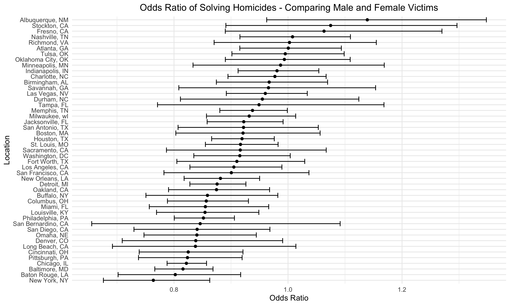

p8105_hw6_rs4338
================
Rebecca Shyu
2024-11-20

``` r
weather_df = 
  rnoaa::meteo_pull_monitors(
    c("USW00094728"),
    var = c("PRCP", "TMIN", "TMAX"), 
    date_min = "2017-01-01",
    date_max = "2017-12-31") %>%
  mutate(
    name = recode(id, USW00094728 = "CentralPark_NY"),
    tmin = tmin / 10,
    tmax = tmax / 10) %>%
  select(name, id, everything())
```

## Problem 2:

``` r
homicide_df = read_csv("data/homicide-data.csv", na = c("", "Unknown"),
                       col_types = cols(
                         victim_sex = col_factor(levels = c("Female", "Male")),
                         victim_race = col_factor(),
                         disposition = col_factor()
                       )) %>% 
  janitor::clean_names() %>% 
  mutate(
    city_state = paste(city, state, sep = ", "),
    city_state = as.factor(city_state),
    reported_date = as.Date(as.character(reported_date), format = "%Y%m%d"),
    solved = if_else(disposition == "Closed by arrest", 1, 0)
  ) %>% 
  filter(
    !(city_state == "Dallas, TX" | city_state == "Phoenix, AZ" | city_state == "Kansas City, MO" | city_state == "Tulsa, AL"),
    (victim_race == "White" | victim_race == "Black")
  )
```

- For the city of Baltimore, MD, use the glm function to fit a logistic
  regression with resolved vs unresolved as the outcome and victim age,
  sex and race as predictors

``` r
balt_df = homicide_df %>% 
  filter(city_state == "Baltimore, MD")

fit = glm(solved ~ victim_age + victim_sex + victim_race, data = balt_df)

fit %>% 
  broom::tidy(conf.int=TRUE, exponentiate = TRUE) %>% 
  filter(
    term == "victim_sexMale"
  ) %>% 
  knitr::kable(caption = "Baltimore Sample Results")
```

| term           |  estimate | std.error | statistic | p.value |  conf.low | conf.high |
|:---------------|----------:|----------:|----------:|--------:|----------:|----------:|
| victim_sexMale | 0.8157365 | 0.0319229 | -6.379876 |       0 | 0.7662616 | 0.8684057 |

Baltimore Sample Results

- Now run glm for each of the cities in your dataset, and extract the
  adjusted odds ratio (and CI) for solving homicides comparing male
  victims to female victims.
- Create a plot that shows the estimated ORs and CIs for each city.
  Organize cities according to estimated OR, and comment on the plot.
  - The plot shows that there is a larger discrepancy between solved
    homicides when considering gender of the victim. In Albuquerque, the
    odds ratio is greater than 1 which means cases for male victims are
    about 16% more likely to be solved for male victims. In the majority
    of other cities, the odds ratio is less than 1, so cases for female
    victims in these cities are more likely to be solved. NYC is very
    skewed to under 0.8, which means over 20% more likely.

``` r
prob2_function = function(input_df) {
  fit = glm(solved ~ victim_age + victim_sex + victim_race, data = input_df)

  return(
    fit %>% 
      broom::tidy(conf.int=TRUE, exponentiate = TRUE) %>% 
      filter(
        term == "victim_sexMale"
      ) %>% 
      select(estimate, conf.low, conf.high)
  )
}

homicide_result = 
  homicide_df %>% 
  group_by(city_state) %>% 
  nest() %>% 
  mutate(
    glm_tests = map(data, prob2_function)
  ) %>% 
  unnest(glm_tests) 

homicide_result %>% 
  ungroup() %>% 
  mutate(
    city_state = fct_reorder(city_state, estimate)
  ) %>% 
  ggplot(aes(y = city_state, x=estimate)) +
  geom_point() +
  geom_errorbar(aes(xmin = conf.low, xmax = conf.high))+
  labs(
    title = "Odds Ratio of Solving Homicides - Comparing Male and Female Victims",
    x = "Odds Ratio",
    y = "Location"
    ) +
  theme(
    plot.title = element_text(hjust = 0.5)
    )
```


